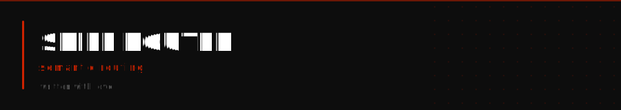

<a href="#install"></a>
<a href="#usage"></a>
<a href="#scoring"></a>
<a href="#standard"></a>

---

Semantic routing for Claude Code skills. Instead of exposing all 60+ skill descriptions in every session (and paying the token cost each time), skill-router builds a compact catalog from frontmatter and scores matches against a natural-language query.

## The problem

Claude Code loads every installed skill's full description at session start. With a large skill library, this is significant token overhead on every single message. And when you add a new skill, you have to remember what it is called to invoke it.

## How it works

Each skill has a `SKILL.md` with structured frontmatter:

```yaml
name: deploy-service
description: Deploy a service to production. One command from local to live.
tags: deploy, vps
triggers:
  - "deploy to production"
  - "push to vps"
```

`catalog.sh` reads all skill frontmatter and emits a compact one-line-per-skill index. `route.sh` scores that index against your query using tag matches, description keywords, and trigger phrases. Top matches return in under a second.

## Install

Clone into your Claude Code commands directory:

```bash
git clone https://github.com/madebymadhouse/skill-router.git ~/.claude/commands/skill-router
chmod +x ~/.claude/commands/skill-router/scripts/*.sh
```

## Usage

### Find the right skill for a task

```bash
bash ~/.claude/commands/skill-router/scripts/route.sh "deploy docs to production"
```

Output:
```
[9] docs-deploy
[6] worker-deploy
[3] vps-service
```

### Browse full catalog

```bash
bash ~/.claude/commands/skill-router/scripts/catalog.sh
```

### Filter by domain

```bash
bash ~/.claude/commands/skill-router/scripts/catalog.sh "audit"
```

### Use a custom skills directory

```bash
SKILLS_DIR=/path/to/your/skills bash ~/.claude/commands/skill-router/scripts/route.sh "your query"
```

## Scoring

| Match type | Points |
|---|---|
| Trigger phrase match | 4 |
| Tag match | 3 |
| Description keyword match | 2 |

Top 5 results returned. Score 0 = no match.

## Standard

For reliable routing, every skill should have:

- `description:` — one tight sentence (this is the catalog entry)
- `tags:` — comma-separated domain tags
- `triggers:` — explicit phrases that unambiguously map to this skill

Skills missing these fields are not routable and will be skipped.

---

Built by [Mad House](https://github.com/madebymadhouse). See the full skill library at [madebymadhouse/skills](https://github.com/madebymadhouse/skills).
